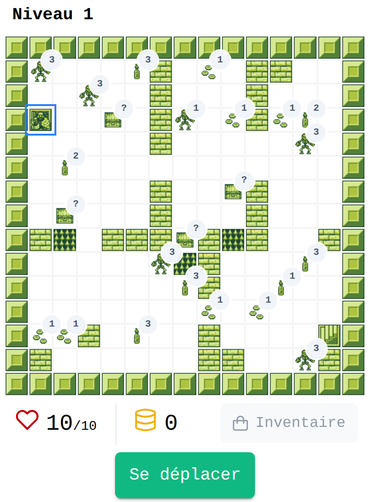
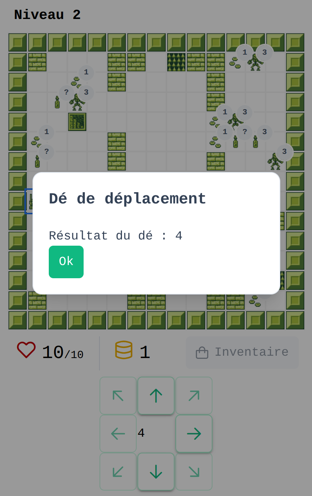

# Dungeon Crawler

> Un jeu de rôle (RPG) "old school" casual développé avec **Angular 21**. Explorez des donjons, combattez des monstres et récoltez des trésors dans une quête pour survivre le plus longtemps possible.

## 📜 À propos du projet

**Dungeon Crawler** est une expérience de jeu fantasy légère qui réinvente les codes du RPG classique directement dans le navigateur. Plongez dans une atmosphère rétro où chaque décision compte : affrontez des créatures, gérez vos ressources et tentez d'aller le plus loin possible dans le donjon.

Ce projet est une démonstration technique de l'utilisation d'**Angular 21** pour la création de jeux vidéo, prouvant que le framework peut gérer des boucles de jeu et des états complexes de manière performante.

## 🚀 État du projet

⚠️ **Version Alpha**
Ce projet est actuellement en phase de développement actif.

- ✅ **Jouable :** La première version est accessible et testable.
- 🐛 **Bugs connus :** Des instabilités peuvent survenir.
- 🚧 **Fonctionnalités limitées :** Toutes les mécaniques prévues ne sont pas encore implémentées.

### Dernières MAJ

06/05/2026 : Une vue sympa pour le lancer de dé ! Amélioration des boutons de déplacement.

_Ce README sera mis à jour au fur et à mesure de l'avancement du projet._

## 🎮 Comment jouer

Le jeu est disponible à cette adresse :
https://adrien-dutertre.github.io/dungeon-crawler/

## 🛠️ Stack Technique

- **Framework** : Angular 21
- **Langage** : TypeScript
- **Stylisation** : CSS / TailwindCSS
- **Gestion d'état** : Signals / RxJS (à adapter selon votre implémentation réelle)

## 📸 Captures d'écran

| Exploration de donjon                             | Combat contre un monstre                              |
| :------------------------------------------------ | :---------------------------------------------------- |
|  |  |

## 🤝 Contribuer

Bien que ce projet soit avant tout une vitrine personnelle, les retours sont les bienvenus. Si vous rencontrez un bug critique ou avez une suggestion d'amélioration, n'hésitez pas à ouvrir une Issue.

## 📄 Licence

Ce projet est distribué sous la licence GNU GPLv3. Voir le fichier [LICENSE](LICENSE.md)
